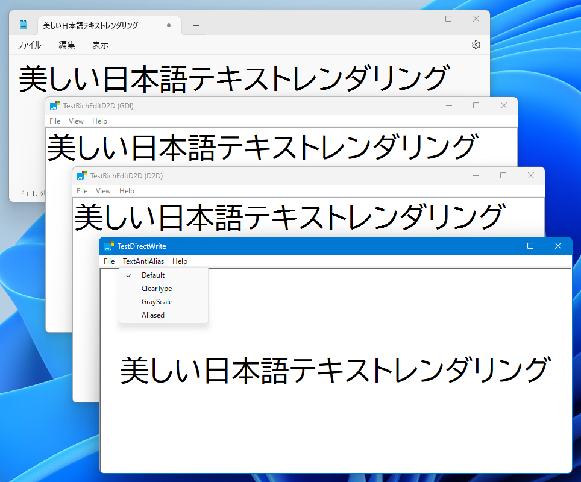
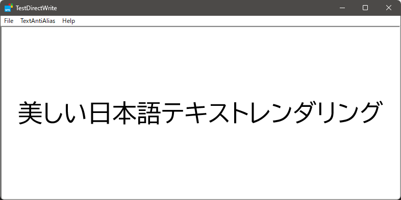
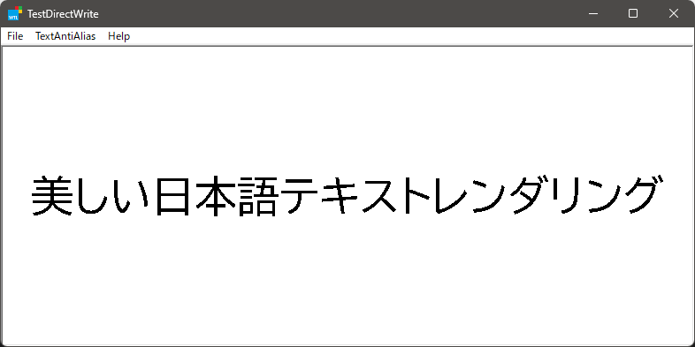
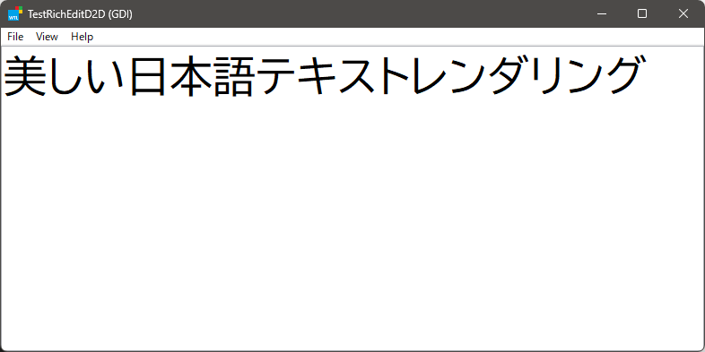
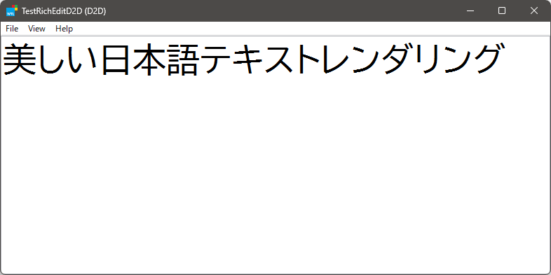

# TestD2DTextRender

Windows 11において、Notepad.exeのテキストレンダリング品質に疑問を覚えた。特に日本語の漢字かな文字で顕著なジャギーを認めた。そこで、Direct2D/DirectWrite環境におけるテキストレンダリングの方法について調査した。これは実験であり、実用的な実装ではない。  

On Windows 11, the text rendering quality of Notepad.exe was questionable. In particular, I observed significant jaggies in Japanese Kanji/kana characters. Therefore, I investigated the text rendering method in the Direct2D/DirectWrite environment. This is an experiment, not a practical implementation.

## Results and Discussion

2種類のアプリを試作し、テキストレンダリングの状態を観察した。  
I made two prototypes of the application and made comparative observations of the text rendering quality.  

- using Direct2D/DirectWrite API
  - text antialias mode = `D2D1_TEXT_ANTIALIAS_MODE_DEFAULT`
  - text antialias mode = `D2D1_TEXT_ANTIALIAS_MODE_CLEARTYPE`
  - text antialias mode = `D2D1_TEXT_ANTIALIAS_MODE_GRAYSCALE`
  - text antialias mode = `D2D1_TEXT_ANTIALIAS_MODE_ALIASED`
- using RichEditD2D control
  - default GDI
  - switch to `EM_SWITCHTOD2D`

以下にそれぞれのレンダリング結果のキャプチャを示す:  
Here is a capture of each rendering result:  

|Condition|Capture|Quality|
|-|-|-|
|Direct2D/DirectWrite (Default)||😊|
|Direct2D/DirectWrite (ClearType)||😊|
|Direct2D/DirectWrite (GrayScale)||😊|
|Direct2D/DirectWrite (Aliased)||😡|
|RichEditD2D (GDI)||😊|
|RichEditD2D (D2D)||🤔|

- **DirectWrite (Aliased)** では顕著なエイリアスが認められ、予想通りの結果である。
- **RichEditD2D (D2D)** では少々のエイリアスが認められ、RichEditD2Dコントロールの不備であると考える。
- その他のケースではアンチエイリアス処理は良好に見える。

総合して、Direct2D/DirectWrite APIの動作に問題は無く、RichEditD2DコントロールのD2Dモードに問題があるようだ。

- **DirectWrite (Aliased)** shows significant aliasing, which is to be expected.
- **RichEditD2D (D2D)** shows a small amount of aliasing, which we believe is a fault of the RichEditD2D control.
- In other cases, anti-aliasing appears to be good.

Overall, there is no problem with the Direct2D/DirectWrite API behavior, and there seems to be a problem with the D2D mode of the RichEditD2D control.

## Requirement to Build

* Visual Studio 2019
* Windows Template Library (WTL) 10

## References

* [RichEditD2D Window Controls](https://devblogs.microsoft.com/math-in-office/richeditd2d-window-controls/)

## Written by

[yu2924](https://twitter.com/yu2924)

## License

CC0 1.0 Universal
